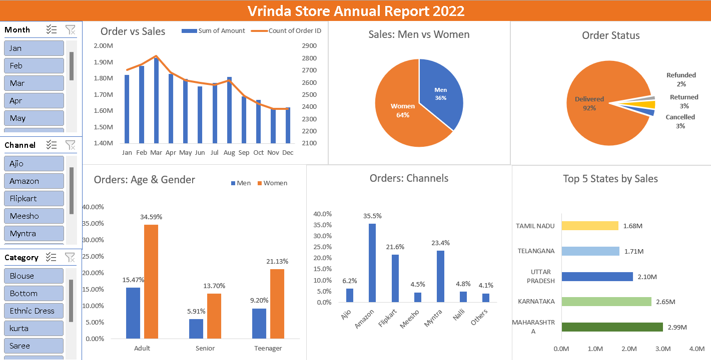

# Vrinda Store Annual Sales Dashboard (Excel)

## Overview

This project is an interactive Excel dashboard created to analyze the annual sales performance of Vrinda Store for the year 2022. The dashboard provides business insights through charts, KPIs, and slicers, helping users understand sales trends, customer demographics, order status, and channel performance.

## Dashboard Preview



## Features

- Monthly Sales and Order Analysis
- Sales Distribution by Gender
- Order Status Breakdown
- Orders by Age Group and Gender
- Sales by Sales Channel
- Top 5 States by Sales
- Interactive Slicers for:
  - Month
  - Sales Channel
  - Product Category

## Tools Used

- Microsoft Excel
- Pivot Tables
- Pivot Charts
- Slicers
- Data Cleaning
- Dashboard Design and Formatting

## Business Insights

- Women contributed the majority of total sales.
- Most orders were successfully delivered.
- Amazon generated the highest number of orders among all sales channels.
- Maharashtra recorded the highest sales among all states.
- Adult customers placed the highest number of orders.
- Sales peaked during the first quarter and gradually declined towards the end of the year.

## Project Structure

```
Vrinda-Store-Annual-Sales-Dashboard/
│
├── Vrinda Store Annual Report Dataset.xlsx
├── Vrinda Store Annual Report.xlsx
├── Dashboard.png
└── README.md
```

## Learning Outcomes

Through this project, I practiced:

- Data cleaning in Excel
- Creating Pivot Tables
- Building Pivot Charts
- Using Slicers for interactivity
- Dashboard design and visualization
- Extracting business insights from sales data
